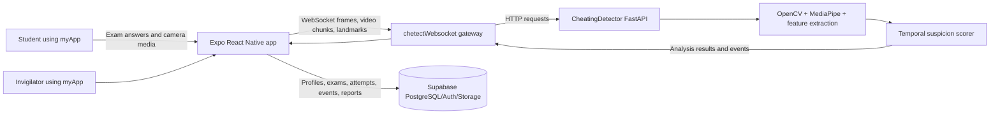
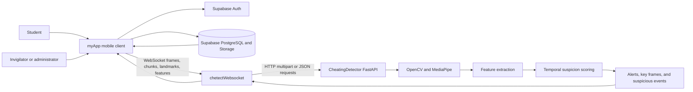
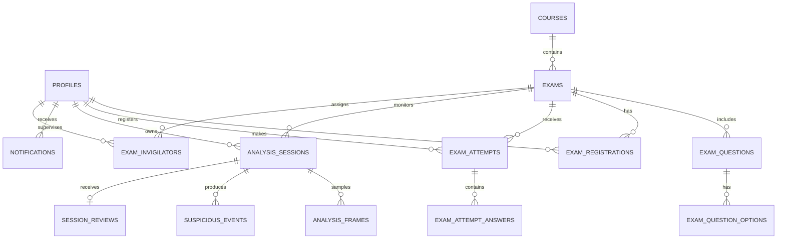

# Chetect Final Year Project Documentation Brief

## Purpose of This Document

This document is the working documentation brief for the Chetect final year project submission. It is intended to be given to Claude or another document-generation assistant to produce a professionally formatted academic report in DOCX and/or PDF format.

The current scope covers:

- Preliminary pages
- Chapter One: Introduction
- Chapter Two: Literature Review
- Chapter Three: System Analysis and Methodology

Later chapters may cover implementation, testing, results, discussion, conclusion, recommendations, references, and appendices.

## Authoring Instructions for the Document Generator

1. Write in formal academic English appropriate for a fourth-year university computing project.
2. Preserve the project name as **Chetect**.
3. Do not invent student names, matriculation numbers, supervisor names, dates, measurements, participant counts, accuracy values, or test results. Use clearly marked placeholders where information is not available.
4. Distinguish implemented functionality from proposed or future functionality.
5. Base technical claims on the project codebases described below.
6. Explain technical terms the first time they appear, then use the abbreviation consistently.
7. Use numbered headings matching the structure in this file.
8. Add automatic page numbers, a table of contents, a list of figures, a list of tables, and a list of abbreviations in the final DOCX/PDF.
9. Use consistent captions such as `Figure 3.1: High-Level Chetect System Architecture` and `Table 2.1: Comparative Analysis of Existing Systems`.
10. Use a consistent citation style required by the department. If no style is specified, use APA 7th edition and include only verifiable sources.
11. Do not cite the project source code as external literature. Refer to it as the developed system or project implementation where appropriate.
12. Mark claims that require user confirmation with `[TO CONFIRM]` instead of silently filling them in.
13. Keep the abstract between 150 and 300 words.
14. Generate both an editable DOCX and a PDF where the tool supports both formats.
15. Run a final consistency check for heading numbering, cross-references, figure/table captions, acronym definitions, and placeholder removal.

## Image and Diagram Generation Instructions

The final report should include original diagrams and selected screenshots. Generate diagrams as clean, high-resolution vector graphics or editable diagram objects whenever possible. Do not use copyrighted images, random stock images, decorative AI artwork, or diagrams that imply features not present in the codebase.

Required or recommended visuals:

- Title page logo or institutional mark, if the author provides an approved asset.
- Figure 3.1: High-level architecture showing `myApp`, `chetectWebsocket`, `CheatingDetector`, and Supabase.
- Figure 3.2: Student examination workflow.
- Figure 3.3: Invigilator monitoring and review workflow.
- Figure 3.4: Detector analysis pipeline from image/video input to suspicious event output.
- Figure 3.5: WebSocket message flow between the mobile app, gateway, and detector API.
- Figure 3.6: Entity Relationship Diagram for the main Supabase tables.
- Figure 3.7: Use Case Diagram for students, invigilators, and administrators.
- Figure 3.8: Sequence Diagram for a monitored exam session.
- Screenshots of the student portal, exam session, invigilator dashboard, monitoring screen, and report/review screen, using screenshots supplied by the author.

For every generated figure:

- Include a figure number and descriptive caption.
- Include a short explanation in the surrounding text.
- Use accessible labels and readable text at normal page zoom.
- Keep colors professional and printer-friendly.
- Use the same names as the codebase: `myApp`, `chetectWebsocket`, `CheatingDetector`, Supabase, `analysis_sessions`, `analysis_frames`, and `suspicious_events`.
- Prefer Mermaid, PlantUML, draw.io, or editable SVG for technical diagrams.
- If image generation is unavailable, insert a clearly labelled placeholder containing the requested figure title and generation prompt.

Suggested architecture diagram source:



## Project Identity and Technical Basis

### Project Title

**Chetect: A Real-Time Examination Platform with Automated Video-Based Cheating Detection and Invigilator Review**

Use the final approved title if the department or supervisor has specified a different wording.

### Project Summary

Chetect is a role-based examination and examination-monitoring platform designed for an academic institution. It combines a mobile examination application, a real-time WebSocket gateway, a computer-vision analysis API, and a Supabase-backed data platform.

The mobile application is built with Expo, React Native, TypeScript, and Expo Router. It provides separate student and invigilator/admin portals. Students can access registered examinations, answer questions, submit attempts, and view results. Invigilators and administrators can manage or monitor examination activity, inspect alerts, review suspicious sessions, and record integrity decisions.

The computer-vision service is a Python FastAPI application using OpenCV, MediaPipe face mesh, feature extraction, temporal session state, and suspicion scoring. It accepts images, landmarks, and uploaded video. It detects signals including no face, multiple faces, gaze deviation, head movement, blinking-related signals, low light, and camera obstruction. Related frames can be grouped into suspicious events with timestamps, severity, reasons, and evidence metadata.

The WebSocket gateway provides a real-time transport layer between the mobile application and the detector API. It accepts image frames, video chunks, landmarks, and features, maintains detector sessions, and returns analysis results to the client.

### Codebases Examined

| Codebase | Primary role | Main technologies |
|---|---|---|
| `myApp` | Student examination and invigilator mobile application | Expo, React Native, TypeScript, Expo Router, Supabase client |
| `CheatingDetector` | Computer-vision analysis API and scoring pipeline | Python, FastAPI, OpenCV, MediaPipe, NumPy |
| `chetectWebsocket` | Real-time analysis gateway | Python, FastAPI WebSockets, httpx |

### Known Data Domains

The Supabase schema includes or is designed around the following domains:

- Profiles and role-aware authentication
- Courses and scheduled examinations
- Examination questions and answer options
- Student registrations and examination attempts
- Invigilator assignments
- Proctoring analysis sessions
- Sampled analysis frames
- Suspicious events and evidence
- Session reviews and integrity decisions
- Notifications and audit logs

## Preliminary Pages

### Title Page

Include:

- Project title
- Student full name: `[STUDENT NAME]`
- Matriculation/registration number: `[MATRICULATION NUMBER]`
- Department: `[DEPARTMENT]`
- Faculty/School: `[FACULTY OR SCHOOL]`
- University: `[UNIVERSITY NAME]`
- Supervisor: `[SUPERVISOR NAME]`
- Month and year of submission: `[MONTH YEAR]`

### Declaration Page

Add a formal declaration stating that the project is the student's original work, that sources have been acknowledged, and that the work has not been submitted elsewhere for another qualification. Include signature and date placeholders.

### Certification/Approval Page

Provide approval wording and signature blocks for:

- Project supervisor
- Head of Department
- Any additional examiner or coordinator required by the department

Include names, signatures, and dates as placeholders until confirmed.

### Dedication

Optional. Include only if the author supplies approved wording.

### Acknowledgements

Draft a concise acknowledgement section for the supervisor, department, institution, participants or evaluators, and family/supporters. Do not invent names.

### Abstract

Write a 150-300 word abstract covering:

- The problem of examination integrity and limitations of purely manual monitoring.
- The development of Chetect as an integrated examination and monitoring platform.
- The use of a React Native mobile client, Supabase services, a WebSocket gateway, and a Python computer-vision detector.
- The types of signals and events analysed.
- The role of invigilator review and the limits of automated detection.
- The confirmed project outcome, using measured results only when supplied by the author.

### Table of Contents

Generate automatically from heading styles. Do not manually type page numbers.

### List of Figures

Generate automatically from figure captions.

### List of Tables

Generate automatically from table captions.

### List of Abbreviations/Acronyms

Use only abbreviations that appear in the report. A starting list may include:

| Abbreviation | Meaning |
|---|---|
| API | Application Programming Interface |
| CV | Computer Vision |
| DFD | Data Flow Diagram |
| ERD | Entity Relationship Diagram |
| HTTP | Hypertext Transfer Protocol |
| MCQ | Multiple-Choice Question |
| REST | Representational State Transfer |
| RLS | Row-Level Security |
| SQL | Structured Query Language |
| UI | User Interface |
| UML | Unified Modeling Language |
| WebSocket | A persistent, two-way communication protocol over a network connection |

Confirm whether the department wants `WebSocket` treated as an acronym or written as a technology name.

# Chapter One: Introduction

## 1.1 Background of the Study

Discuss the growth of computer-based examinations and the need for trustworthy, scalable examination administration. Explain the weaknesses of fully manual invigilation, including limited observation capacity, delayed reporting, inconsistent documentation, and difficulty reviewing long recordings.

Introduce automated or assisted proctoring as a way to support invigilators rather than replace academic or disciplinary judgement. Explain that Chetect combines examination delivery with camera-based analysis and human review. The system analyses visual signals and presents alerts or suspicious events for an authorised invigilator to inspect.

The background should establish the institutional context without claiming that the system is deployed institution-wide unless the author confirms this.

## 1.2 Statement of the Problem

Frame the problem around the separation between examination delivery and examination integrity monitoring. A student may complete an online examination while an invigilator lacks timely, structured evidence about camera visibility, multiple faces, prolonged absence, unusual gaze direction, or repeated head movement.

State the key problems addressed by Chetect:

- Manual monitoring does not scale efficiently across many candidates.
- Raw video is expensive and time-consuming to inspect.
- Alerts may be difficult to interpret without timestamps and explanations.
- Examination attempts, proctoring sessions, evidence, and review decisions can become fragmented across tools.
- Automated signals alone cannot reliably establish cheating and therefore require invigilator review.

## 1.3 Aim and Objectives

### Aim

To design and develop an integrated examination platform that supports online examination delivery, real-time computer-vision-based monitoring, suspicious-event reporting, and invigilator review.

### Objectives

1. To analyse the requirements of students, invigilators, and administrators involved in computer-based examinations.
2. To design a role-based mobile application for examination access, submission, monitoring, and review workflows.
3. To implement examination data management for courses, exams, registrations, questions, options, attempts, and results.
4. To develop a computer-vision service that extracts facial and behavioural features from images and video.
5. To implement temporal scoring and suspicious-event grouping for signals such as no face, multiple faces, gaze deviation, head movement, low light, and camera obstruction.
6. To implement a WebSocket gateway for near-real-time communication between the mobile application and detector service.
7. To store examination, analysis, evidence, notification, and audit data securely using Supabase and database access policies.
8. To provide invigilators with interpretable alerts and review records rather than relying on an automated accusation.
9. To test the functional behaviour, integration points, usability, and performance of the developed system using documented test cases.

## 1.4 Research Questions / Hypotheses

Use research questions unless the department specifically requires hypotheses.

1. How can an integrated examination platform improve the organisation of online examination delivery and monitoring?
2. How effectively can computer-vision signals identify potentially suspicious examination behaviour for invigilator attention?
3. How can real-time communication reduce the delay between detection and invigilator awareness?
4. How can suspicious events be represented in a way that supports transparent human review?
5. What technical and operational limitations affect the reliability of automated examination monitoring?

Do not state a detection accuracy hypothesis until a labelled evaluation dataset and measurement procedure are available.

## 1.5 Significance of the Study

Explain the potential value to:

- Students: a structured examination experience and clear submission records.
- Invigilators: prioritised alerts, timestamps, evidence metadata, and review workflows.
- Institutions: centralised examination records, role-based access, auditability, and scalable monitoring support.
- Researchers and developers: a modular integration of mobile examination delivery, WebSocket transport, and computer-vision analysis.
- Academic integrity processes: a documented distinction between an automated alert and a final human decision.

Avoid claiming that the system eliminates cheating or makes definitive misconduct decisions.

## 1.6 Scope and Limitations of the Study

### Scope

The project covers:

- Student and invigilator/admin roles.
- Course, examination, registration, question, option, attempt, and result workflows.
- Mobile client navigation and authenticated session handling.
- Image, landmark, and video analysis through the detector service.
- Real-time gateway communication using WebSockets.
- Suspicion scoring, event grouping, evidence metadata, notifications, reviews, and audit records.
- Supabase authentication, PostgreSQL data storage, row-level security, and storage integration where configured.

### Limitations

- Computer-vision outputs are indicators for review, not proof of cheating.
- Performance depends on camera quality, lighting, framing, network reliability, device capability, and video orientation.
- Face-based analysis may produce false positives or false negatives.
- The detector does not understand all forms of cheating, including off-camera devices or non-visual collaboration.
- The current system depends on network access between the mobile app, gateway, detector, and Supabase services.
- The available implementation and test suites do not by themselves establish production-scale accuracy or institutional deployment readiness.
- Privacy, consent, retention, accessibility, and institutional policy requirements must be confirmed and documented before real-world deployment.

## 1.7 Definition of Terms

Define at least the following in the final report:

- **Automated proctoring:** Software-assisted monitoring of an examination using signals collected from a candidate's device or environment.
- **Computer vision:** Computational analysis of images or video to identify objects, faces, landmarks, or visual patterns.
- **Face landmark:** A coordinate representing a recognised point on a face, such as an eye, nose, or mouth region.
- **Feature extraction:** Conversion of visual measurements into numerical values used for analysis.
- **Suspicion score:** A numerical or categorical indication that observed signals require attention; it is not a final misconduct decision.
- **Suspicious event:** A grouped time interval containing one or more analysis signals that meet the configured event criteria.
- **Invigilator:** An authorised staff member who supervises examinations and reviews alerts.
- **WebSocket gateway:** A server that maintains persistent two-way connections and forwards analysis messages between the client and detector service.
- **Analysis session:** A stateful record representing monitoring activity for a student's examination attempt.
- **Row-Level Security:** Database policies that restrict which rows a signed-in user may access.

## 1.8 Organization of the Report

Provide a short summary of the final report chapters. Use the following as a draft and update it when later chapters are written:

- Chapter One introduces the study, problem, objectives, significance, scope, and key terms.
- Chapter Two reviews relevant concepts, technologies, algorithms, existing examination systems, and research gaps.
- Chapter Three explains the system analysis, methodology, requirements, design tools, architecture, and technology choices.
- Chapter Four presents the system implementation and major user interfaces.
- Chapter Five presents testing, evaluation results, and discussion.
- Chapter Six presents the conclusion, recommendations, limitations, and possible future work.

# Chapter Two: Literature Review

## 2.1 Introduction

Introduce the purpose of the literature review: to establish the concepts, technologies, methods, and existing systems relevant to online examinations, automated or assisted proctoring, computer vision, real-time communication, and secure academic data management.

Use current, peer-reviewed, official, or authoritative sources. Separate academic literature from product documentation.

## 2.2 Conceptual Framework / Theoretical Background

Present Chetect as a human-in-the-loop monitoring system:

```text
Examination activity
        |
        v
Camera/video input and exam interaction
        |
        v
Feature extraction and signal detection
        |
        v
Temporal scoring and event grouping
        |
        v
Alert, evidence metadata, and prioritisation
        |
        v
Invigilator review and integrity decision
        |
        v
Audit trail and examination record
```

Explain that the system transforms raw observations into reviewable evidence while preserving human oversight. Discuss the difference between classification, anomaly/signal detection, risk scoring, and an institutional decision.

Relevant theoretical areas may include:

- Human-in-the-loop decision support.
- Technology acceptance and usability for examination systems.
- Information security principles: confidentiality, integrity, availability, authentication, authorisation, and accountability.
- Real-time distributed systems and event-driven communication.
- Computer-vision feature extraction and temporal analysis.

## 2.3 Review of Related Concepts

Cover the following concepts with verified sources and connect each to Chetect:

### Online Examination Systems

Discuss examination scheduling, candidate registration, question delivery, timed attempts, answer submission, grading, and result storage.

### Remote or Automated Proctoring

Discuss camera-based monitoring, alert generation, human review, privacy, consent, fairness, accessibility, and false-positive risk.

### Facial Landmarks and Feature Extraction

Explain how facial landmarks can support measurements such as gaze direction, eye aspect ratio or blink-related signals, head pose, and mouth openness. Avoid claiming that a single feature proves intent.

### Suspicion Scoring and Temporal Reasoning

Explain why repeated or sustained signals are more meaningful than a single noisy frame. Relate this to transient signal rules, thresholds, severity, rolling session state, and grouped suspicious intervals in the detector implementation.

### WebSockets and Real-Time Systems

Explain persistent bidirectional communication and why a gateway can be used for low-latency frame or chunk transport.

### Cloud Databases, Authentication, and Row-Level Security

Explain how Supabase provides authentication and PostgreSQL-backed storage, and why role-based policies matter for student records, evidence, reviews, and audit logs.

### Privacy and Responsible Use of AI Monitoring

Discuss informed consent, data minimisation, retention, access control, transparency, reviewability, accessibility, bias, and the requirement for human confirmation.

## 2.4 Review of Related/Existing Systems

Review relevant categories of systems rather than naming unsupported products as direct competitors:

- Traditional in-person invigilation.
- Basic online examination platforms without automated monitoring.
- Video-recorded examination review systems.
- Automated remote-proctoring platforms.
- Institution-specific examination management systems.
- Research prototypes for facial behaviour or gaze analysis.

For each system category, discuss common capabilities, benefits, weaknesses, privacy concerns, and how Chetect addresses or differs from them.

## 2.5 Comparative Analysis of Existing Systems

Create a table similar to the following, replacing placeholders with evidence from cited sources:

| Feature | Manual invigilation | Basic online exam system | Recorded review system | Automated proctoring system | Chetect |
|---|---|---|---|---|---|
| Exam scheduling | Yes | Usually | Usually | Usually | Yes |
| Question delivery and submission | Manual or separate | Yes | Varies | Varies | Yes |
| Live camera monitoring | Yes | Usually no | No | Often | Gateway-supported |
| Automated visual signal analysis | No | No | Usually no | Often | Yes |
| Suspicious-event timestamps | Manual notes | No | Manual review | Often | Yes |
| Human invigilator review | Yes | Limited | Yes | Required or recommended | Yes |
| Role-based access | Institutional process | Varies | Varies | Varies | Supabase-backed |
| Audit trail | Paper or separate system | Varies | Varies | Varies | Designed into schema |
| Local institutional customisation | High | Varies | Varies | Varies | High |
| Privacy and retention control | Institutional | Institutional | Vendor/institutional | Vendor/institutional | Must be configured and governed |

Label this table as a draft comparison until the literature sources are selected.

## 2.6 Gaps Identified in Literature

Identify and support gaps such as:

- Fragmentation between exam delivery, live analysis, evidence, and review.
- Limited interpretability of black-box alerts.
- Insufficient temporal context when decisions are based on individual frames.
- Weak integration between automated signals and institutional review workflows.
- Privacy, fairness, accessibility, and governance concerns in automated proctoring.
- The need for institution-configurable systems that can operate with explicit human oversight.

Only present a gap as established when supported by the reviewed literature. Present Chetect's contribution as a software engineering response to the identified requirements, not as a universal solution.

## 2.7 Summary of Literature Review

Summarise the major concepts, the limitations of existing approaches, the need for a human-in-the-loop platform, and how the identified gaps motivate the system analysis and methodology in Chapter Three.

# Chapter Three: System Analysis and Methodology

## 3.1 Introduction

Introduce the development approach, existing-system analysis, proposed-system analysis, requirements, design artefacts, hardware/software environment, and technology justification.

## 3.2 Research/Development Methodology

Use an iterative Agile or incremental software development methodology unless the author confirms another methodology. Justify it using the project's modular architecture and need to refine the mobile client, detector pipeline, gateway, and database integration independently.

Suggested iterative stages:

1. Requirements elicitation and problem definition.
2. Architecture and data-model design.
3. Mobile examination workflow implementation.
4. Detector and scoring pipeline implementation.
5. WebSocket gateway integration.
6. Supabase authentication, database, storage, and policies.
7. Unit, API, integration, and workflow testing.
8. Evaluation, refinement, documentation, and deployment preparation.

If the actual project followed Waterfall, RAD, OOADM, or another method, replace this section with the confirmed process and evidence.

## 3.3 Analysis of the Existing System

Describe the likely existing or conventional process as a baseline, clearly distinguishing confirmed institutional practice from a general problem context:

- Examination scheduling may be handled separately from candidate communication.
- Students may use one system for questions and another process for monitoring.
- Invigilators may rely on direct observation or manually reviewing recordings.
- Evidence may not be linked automatically to the student's examination attempt.
- Review and audit decisions may be recorded outside a single structured data model.

Mark institution-specific claims as `[TO CONFIRM]` unless the author provides process documentation or interview evidence.

## 3.4 Problems of the Existing System

Analyse the baseline in terms of:

- Fragmented workflows.
- Limited scalability of manual observation.
- Delayed identification of incidents.
- Lack of structured timestamps and evidence metadata.
- Inconsistent review documentation.
- Weak linkage between examination attempts and monitoring records.
- Privacy and governance risks when media is retained without clear access and retention rules.

## 3.5 Analysis of the Proposed System

Describe the proposed system as four cooperating layers:

### Client Layer: `myApp`

An Expo/React Native TypeScript application using Expo Router. It provides authentication-aware navigation and separate student and invigilator/admin route groups.

### Gateway Layer: `chetectWebsocket`

A FastAPI WebSocket service that accepts persistent client connections, creates or resets detector sessions, handles image frames, video chunks, landmarks, and features, and forwards calls using an asynchronous HTTP client.

### Analysis Layer: `CheatingDetector`

A FastAPI service exposing session, image, landmark, score, video, video-summary, and dataset endpoints. The analysis service combines OpenCV video handling, MediaPipe face mesh, feature extraction, suspicion scoring, temporal state, signal observations, alerts, events, and key frames.

### Data and Governance Layer: Supabase

Supabase Auth and PostgreSQL provide user profiles, role-aware access, exams, questions, attempts, analysis sessions, frames, suspicious events, reviews, notifications, audit records, and storage policies where configured.

## 3.6 Requirement Analysis

### Functional Requirements

#### Authentication and Roles

- The system shall authenticate users through Supabase Auth.
- The system shall support student, invigilator, and admin roles.
- The system shall route users to authorised portal screens according to their role.
- The system shall prevent unauthorised access to other users' examination and monitoring records.

#### Examination Management

- The system shall support courses and scheduled examinations.
- The system shall support examination duration, status, monitoring mode, instructions, and access details.
- The system shall support questions and multiple-choice options.
- The system shall support student registration and candidate status.

#### Student Examination

- The system shall allow an authorised student to view registered examinations.
- The system shall allow a student to load examination questions and options.
- The system shall allow a student to select and persist answers during an attempt.
- The system shall submit an attempt and calculate or retrieve the result according to the configured database logic.
- The system shall prevent invalid or duplicate submission according to the attempt state.

#### Monitoring and Detection

- The system shall create and maintain an analysis session for a monitored attempt.
- The system shall accept images, landmarks, features, and video chunks through the gateway or detector API.
- The system shall extract and score supported visual signals.
- The system shall return labels, scores, observations, alerts, events, timestamps, and key frames where configured.
- The system shall handle video orientation, mirroring, sampling, frame limits, and inference width settings.

#### Invigilator Review

- The system shall present live or recent monitoring information to authorised invigilators.
- The system shall provide suspicious-event details and evidence metadata.
- The system shall allow an authorised reviewer to record an integrity decision and notes.
- The system shall preserve an audit trail for sensitive actions.

#### Notifications and Data Management

- The system shall provide notifications for relevant examination or monitoring events.
- The system shall store analysis sessions, sampled frames, suspicious events, and review information according to configured retention rules.
- The system shall support session reset and clean sign-out behaviour.

### Non-Functional Requirements

- **Security:** authenticated access, role-based permissions, row-level database policies, protected service credentials, and secure transport in deployment.
- **Privacy:** informed consent, data minimisation, controlled media access, retention limits, and transparent explanation of automated signals.
- **Performance:** responsive exam interaction and bounded analysis payloads through sampling, frame limits, chunking, and summary responses.
- **Availability:** health endpoints, error handling, session recovery, and graceful handling of temporary network or profile failures.
- **Usability:** clear student and invigilator flows, understandable labels, readable alerts, and actionable review context.
- **Scalability:** modular client, gateway, detector, and database layers that can be scaled or deployed independently.
- **Maintainability:** TypeScript typing, Python package structure, API schemas, automated tests, migrations, and documented environment configuration.
- **Interoperability:** HTTP APIs, WebSockets, JSON payloads, multipart media uploads, and Supabase integration.
- **Accuracy and reliability:** signals should be evaluated using a documented dataset and test protocol; do not claim accuracy without measured evidence.

## 3.7 System Design Tools

Use the following design artefacts in the final report. Generate the diagrams from the implementation and keep naming consistent.

### Use Case Diagram

Actors:

- Student
- Invigilator
- Administrator
- Chetect mobile application
- Detector service, if represented as an external system

Use cases:

- Sign in and sign out
- View examination schedule
- Start examination
- Answer and submit questions
- View result
- Create or manage examination
- Assign invigilators
- Monitor examination sessions
- Inspect suspicious events
- Review and decide on a session
- View notifications
- View audit information

### Class or Component Diagram

Show the major software components and their responsibilities:

- `SessionProvider`
- Student exam data service
- Proctoring service
- `AnalysisService`
- `FeatureExtractor`
- `SuspicionScorer`
- WebSocket gateway
- `ModelClient`
- Supabase client and database domains

### Sequence Diagram

Include the sequence for a monitored exam:

1. Student signs in.
2. Mobile app loads profile and exam registration.
3. Student starts an exam.
4. Mobile app creates an analysis session.
5. Mobile app sends frames or video chunks to the WebSocket gateway.
6. Gateway forwards the payload to the detector API.
7. Detector extracts features and computes signals and score.
8. Detector returns analysis data to the gateway.
9. Gateway returns analysis data to the mobile app.
10. The app or backend stores session and event data in Supabase.
11. Invigilator reviews evidence and records a decision.

### Activity Diagram

Show the student flow from authentication through exam eligibility, attempt, monitoring, submission, and result. Include alternative paths for an invalid registration, cancelled exam, exam not started, expired exam, network failure, and already-submitted attempt.

### Entity Relationship Diagram

Include at least these relationships:

- `profiles` to `exam_registrations`
- `courses` to `exams`
- `exams` to `exam_questions`
- `exam_questions` to `exam_question_options`
- `exams` and `profiles` through `exam_invigilators`
- `exam_attempts` to `exam_attempt_answers`
- `exams` and `profiles` to `analysis_sessions`
- `analysis_sessions` to `analysis_frames`
- `analysis_sessions` to `suspicious_events`
- `analysis_sessions` to `session_reviews`
- `profiles` to `notifications`
- `profiles` to `audit_logs`

### Data Flow Diagram

Show data moving from students and invigilators through the mobile client, WebSocket gateway, detector API, and Supabase services. Clearly distinguish media flow from examination-record flow.

## 3.8 Hardware and Software Requirements

### Development Hardware

Use confirmed specifications where available:

| Item | Minimum or proposed requirement |
|---|---|
| Development computer | `[TO CONFIRM]` |
| Processor | `[TO CONFIRM]` |
| Memory | `[TO CONFIRM]` |
| Storage | `[TO CONFIRM]` |
| Camera-enabled test device | Android/iOS device or webcam, `[TO CONFIRM]` |
| Network | Reliable internet connection for cloud services and remote analysis |

### Runtime Hardware

- Camera-enabled smartphone or supported client device for students.
- Invigilator device capable of running the mobile application or supported client workflow.
- Server resources capable of running Python, FastAPI, OpenCV, and MediaPipe.
- Cloud database and storage resources configured for Supabase.

### Software Stack

| Layer | Software |
|---|---|
| Mobile client | Expo SDK 54, React Native 0.81, React 19, TypeScript, Expo Router |
| Mobile services | Supabase JavaScript client, Expo Camera, Expo File System, React Navigation |
| Detector API | Python, FastAPI, Uvicorn/Gunicorn, OpenCV, MediaPipe, NumPy |
| WebSocket gateway | Python, FastAPI WebSockets, httpx |
| Database/authentication | Supabase Auth and PostgreSQL |
| Testing | Python unittest and FastAPI TestClient; project linting and TypeScript checks where configured |
| Deployment options | Render, Vercel, or equivalent configured hosting environments |

## 3.9 Justification for Chosen Tools/Technology Stack

### Expo and React Native

Chosen to support a shared mobile codebase and access to camera, file, navigation, and device capabilities while maintaining a TypeScript-based application structure.

### Expo Router

Chosen for file-based navigation and clear separation between authentication routes, student tabs, invigilator tabs, and exam-session screens.

### Supabase

Chosen to provide managed authentication, PostgreSQL data storage, row-level security, storage integration, and real-time-capable backend services without building all infrastructure from scratch.

### Python and FastAPI

Chosen for rapid development of typed HTTP endpoints and compatibility with the computer-vision ecosystem. FastAPI also provides validation and interactive API documentation.

### OpenCV and MediaPipe

Chosen for video decoding, frame normalisation, image processing, face detection, and facial landmark extraction.

### WebSockets

Chosen to maintain a persistent connection for low-latency transfer of frames, chunks, configuration messages, session commands, and detector responses.

### httpx

Chosen by the gateway for asynchronous communication with the detector API and connection reuse during a WebSocket session.

### Modular Service Architecture

The separation of mobile client, gateway, detector, and data services supports independent testing, deployment, maintenance, and future replacement of individual components.

## Evidence and Items to Supply Before Finalising

The document generator should request or leave placeholders for:

- Student and supervisor identity details.
- Department formatting template and required citation style.
- Confirmed institutional problem context and existing manual workflow.
- Screenshots of implemented student and invigilator screens.
- Hardware specifications and deployment configuration.
- Test results, performance measurements, and any labelled detector evaluation results.
- Approved privacy, consent, data retention, and institutional policy statements.
- Final list of chapters and appendices.
- Approved university logo or other permitted visual assets.

## Accuracy and Ethics Notice

Chetect is an examination support and decision-assistance system. Automated detector labels, scores, alerts, and suspicious events must not be described as definitive proof of cheating. The final report should present the system's output as evidence or a prompt for authorised human review, acknowledge false-positive and false-negative risks, and document privacy and governance requirements.

# Chapter Four: System Design and Implementation

## 4.1 Introduction

This chapter presents the design and implementation of Chetect. It explains the high-level architecture, database structure, user input and output designs, program modules, implementation environment, important implementation decisions, testing activities, and deployment requirements.

The implementation is divided into three cooperating codebases: the Expo/React Native mobile client (`myApp`), the Python WebSocket gateway (`chetectWebsocket`), and the Python computer-vision API (`CheatingDetector`). Supabase provides authentication, PostgreSQL data storage, row-level security, and storage-related services.

## 4.2 System Architecture

Chetect uses a layered service architecture. The mobile client is responsible for user interaction, authentication-aware navigation, examination workflows, camera/media capture, and displaying results. The WebSocket gateway maintains persistent connections and translates client messages into requests to the detector API. The detector performs image/video analysis, feature extraction, scoring, and suspicious-event grouping. Supabase stores application and review records.

### Figure 4.1: High-Level Chetect System Architecture

Generate this figure from the following logical structure:



### Main Runtime Flow

1. A user signs in through the mobile application.
2. The session provider restores the authenticated session and profile role.
3. The student loads a registered examination or an invigilator opens a monitoring view.
4. During a monitored session, the client sends supported media or extracted data to the gateway.
5. The gateway creates or reuses a detector session and forwards the request to the analysis API.
6. The detector normalises media, extracts features, calculates a label and score, and groups relevant signals into events.
7. The response travels back through the gateway to the mobile client.
8. Examination, monitoring, review, notification, and audit records are stored in Supabase according to the configured policies.

The diagram generator should show media flow and database-record flow as separate labelled paths. It should not imply that the detector directly writes to Supabase unless that integration is explicitly configured in the final deployment.

## 4.3 Database Design

The database is implemented in PostgreSQL through Supabase. It uses enumerated types for roles and workflow states, foreign keys for relationships, indexes for common queries, triggers for timestamps and derived examination times, and row-level security policies for access control.

### Figure 4.2: Entity Relationship Diagram

Generate an ER diagram containing the following core relationships:



### Core Table Structures and Data Dictionary

Use the following table as a concise data dictionary. The final report may expand it with data types, constraints, nullability, and security policies directly from `supabase/schema.sql` and migrations.

| Table | Purpose | Important fields |
|---|---|---|
| `profiles` | Stores user identity and application role | `id`, `full_name`, `email`, `institutional_id`, `role`, `department_name` |
| `courses` | Stores reusable course information | `id`, `code`, `title`, `department_name`, `term` |
| `exams` | Stores scheduled examination sessions | `id`, `course_id`, `title`, `scheduled_start`, `scheduled_end`, `duration_minutes`, `monitoring_mode`, `status` |
| `exam_questions` | Stores ordered examination questions | `id`, `exam_id`, `question_order`, `prompt` |
| `exam_question_options` | Stores answer choices | `id`, `question_id`, `option_order`, `option_text` |
| `exam_question_answer_keys` | Stores the correct option for grading | `question_id`, `correct_option_id` |
| `exam_registrations` | Links students to examinations | `id`, `exam_id`, `student_id`, `candidate_number`, `registration_status` |
| `exam_attempts` | Stores a student's attempt and result | `id`, `exam_id`, `student_id`, `status`, `submitted_at`, `score_percent` |
| `exam_attempt_answers` | Stores selected answers | `attempt_id`, `question_id`, `selected_option_id`, `is_correct` |
| `exam_invigilators` | Links staff to supervised exams | `exam_id`, `invigilator_id`, `assigned_by` |
| `analysis_sessions` | Stores the monitoring lifecycle for an attempt | `id`, `exam_id`, `student_id`, `status`, `started_at`, `ended_at`, aggregate metrics, `final_label` |
| `analysis_frames` | Stores sampled detector outputs | `analysis_session_id`, `frame_index`, `face_count`, `score`, `label`, observations, facial measurements |
| `suspicious_events` | Groups related signals over time | `analysis_session_id`, timestamps, label, reason, risk level, evidence, review status |
| `session_reviews` | Stores authorised human review decisions | `analysis_session_id`, `reviewer_id`, `integrity_score`, `final_decision`, notes |
| `notifications` | Stores user-facing alerts and updates | `user_id`, `title`, `body`, `notification_type`, `read_at` |
| `audit_logs` | Records sensitive actions | `actor_id`, `entity_type`, `entity_id`, `action`, `details`, `created_at` |

### Important Database Controls

- Foreign keys maintain relationships between users, exams, attempts, monitoring sessions, and reviews.
- Unique constraints prevent duplicate registrations, duplicate attempts, duplicate question ordering, and duplicate frame indexes within a session.
- Enum types standardise roles, examination states, session states, labels, risk levels, and review decisions.
- Partial indexes prevent multiple active monitoring sessions for the same student and exam.
- Row-level security policies should allow students to access their own records and authorised invigilators to access assigned examination records.
- Service-role credentials must remain on trusted backend infrastructure and must not be exposed in public mobile environment variables.

## 4.4 Input/Output Design

### Student Inputs

- Email or institutional sign-in credentials.
- Examination selection where more than one registered exam is available.
- Multiple-choice answer selections.
- Exam submission confirmation.
- Camera permission and monitoring consent where required by policy.

### Student Outputs

- Authenticated student landing and schedule views.
- Examination title, course details, instructions, duration, and status.
- Ordered questions and answer options.
- Submission status and result information.
- Monitoring status and clear recovery messages for camera or network failures.

### Invigilator/Admin Inputs

- Sign-in credentials.
- Examination creation and scheduling fields.
- Course, question, option, registration, and staff assignment fields.
- Monitoring filters and selected session.
- Review decision, integrity score, and notes.

### Invigilator/Admin Outputs

- Live or recent examination overview.
- Candidate/session status and aggregate risk information.
- Suspicious event timelines, labels, reasons, timestamps, and evidence links where available.
- Review and audit history.
- Notifications and unresolved alert indicators.

### Figure 4.3: Input and Output Mockups

Create clean wireframes or screenshots for:

1. Portal selection screen.
2. Student sign-in and examination schedule.
3. Student examination question screen.
4. Examination submission confirmation and result.
5. Invigilator dashboard and live overview.
6. Suspicious-event detail and review form.

Use actual screenshots from `myApp` where available. If screenshots are unavailable, generate grayscale wireframes based on the implemented route and component names. Label generated mockups as design representations rather than screenshots of a deployed system.

## 4.5 Program/Module Design

### Mobile Application Modules

| Module | Responsibility |
|---|---|
| `app/_layout.tsx` | Loads icon fonts, wraps the app in session state, configures navigation theme, and redirects users by authentication role. |
| `app/index.tsx` | Presents Student and Invigilator portal choices. |
| Session provider | Restores Supabase authentication and profile information, manages loading state, and handles sign-out cleanup. |
| Student exam service | Loads registered exam data, validates eligibility, manages questions and answers, and submits attempts. |
| Proctoring service | Manages detector sessions, media upload/chunking, analysis responses, suspicious-event evidence, and aggregate metrics. |
| Shared components and hooks | Provide consistent screens, theme, branding, alerts, navigation behaviour, and reusable UI. |

### WebSocket Gateway Modules

| Module | Responsibility |
|---|---|
| `app.py` | Exposes health/root routes and the `/ws/analyze` WebSocket endpoint. |
| `ConnectionState` | Stores session, binary payload, sampling, response-mode, orientation, and sequence configuration. |
| `ModelClient` | Calls detector session, image, video, landmark, and scoring endpoints asynchronously. |
| Message handlers | Process image frames, video chunks, landmarks, features, configuration, start, reset, ping, and close messages. |
| Settings | Reads model URL, origin, payload, timeout, sampling, and response defaults from environment variables. |

### Detector Modules

| Module | Responsibility |
|---|---|
| FastAPI application | Defines validated HTTP endpoints for sessions, images, landmarks, scoring, videos, summaries, and datasets. |
| `AnalysisService` | Orchestrates media decoding, frame normalisation, feature extraction, scoring, summaries, alerts, and event grouping. |
| `FeatureExtractor` | Derives facial measurements from recognised landmarks. |
| `SuspicionScorer` | Converts features and face counts into scores, labels, observations, and signals. |
| `FaceMeshRenderer` | Supports face-mesh rendering or visual debugging where configured. |
| `SessionStore` | Preserves temporal extractor and scorer state across related requests. |
| API schemas | Validates request and response shapes. |

### Detector Analysis Pseudocode

```text
FUNCTION analyze_frame(input_frame, session_id, configuration):
        session <- get_or_create_detector_session(session_id)
        frame <- normalise_orientation_and_size(input_frame, configuration)
        face_count, landmarks <- detect_faces_and_landmarks(frame)

        IF face_count is zero:
                features <- empty_feature_set
        ELSE:
                features <- extract_gaze_blink_head_pose_and_mouth_features(landmarks)

        result <- score_features(
                features,
                face_count,
                classifier_output,
                confidence,
                session.scorer_state
        )
        signals <- derive_machine_readable_signals(result)
        observations <- create_human_readable_observations(signals)
        update_temporal_session_state(session, signals, result)

        RETURN label, score, features, signals, observations
```

### Video Event Grouping Pseudocode

```text
FUNCTION analyze_video(video, configuration):
        capture <- open_video(video)
        metadata_rotation <- read_video_orientation(capture)
        events <- empty_event_collection
        frame_results <- empty_result_collection

        FOR each frame_index and frame in capture:
                IF frame_index is not selected by sampling rules:
                        CONTINUE
                normalised_frame <- normalise_frame(frame, metadata_rotation, configuration)
                result <- analyze_frame(normalised_frame, session_id, configuration)
                append result to frame_results
                update_active_events(events, result, frame_index)

                IF sampled_frame_limit is reached:
                        BREAK

        close capture
        finalise_active_events(events)
        RETURN aggregate_metrics, alerts, events, frame_results, key_frames
```

The final report should explain that thresholds and temporal rules are configuration decisions and should be evaluated with labelled data. Do not present them as universally valid medical, psychological, or behavioural thresholds.

## 4.6 Implementation Environment

### Development Environment

The mobile client uses Expo SDK 54, React Native 0.81, React 19, TypeScript, and Expo Router. The detector and gateway use Python and FastAPI. The projects can be developed in Visual Studio Code with the required Node.js and Python environments installed.

### Hosting Environment

The detector project includes deployment configuration for Render and Vercel. The gateway can be hosted as a Python WebSocket service. Supabase hosts the authentication and PostgreSQL services. The final report must identify the actual hosting provider, region, URLs, environment variables, and deployment date used for the submitted demonstration.

### Environment Variables and Secrets

Document environment variable names without publishing secret values. Include:

- Supabase URL and public anon key for the mobile client, using the project's approved configuration process.
- Detector base URL for the WebSocket gateway.
- Allowed origins.
- Detector API timeout and payload limits.
- Sampling, frame, alert, and response-mode defaults.

Never include Supabase service-role keys, database passwords, private signing keys, or other secrets in the report, screenshots, repository, or public mobile bundle.

## 4.7 Implementation Details

Explain the following implementation decisions with short code excerpts and annotated screenshots from the source code. Keep excerpts small and cite the module/file name in the figure or listing caption.

### Role-Aware Navigation

The root layout observes authentication state and profile role. Unauthenticated users are returned to the entry routes. Students are directed to the student tab group, while invigilators and administrators are directed to the invigilator tab group.

### Examination Eligibility and Lifecycle

The student exam service checks the authenticated profile, registration status, examination status, scheduled start/end, and existing attempt before loading questions. The lifecycle synchronisation function updates or retrieves current examination states when the corresponding database RPC is available.

### Stateful Detector Sessions

The detector uses a session store so related frames can share extractor and scorer state. This supports temporal metrics and prevents every frame from being treated as an entirely unrelated observation.

### Media Normalisation

Uploaded video is processed with orientation metadata, optional forced rotation, optional camera mirroring, and an inference-width limit. Sampling and frame limits control payload size and analysis cost.

### Human-Readable and Machine-Readable Results

Detector responses contain labels, scores, features, observations, and machine-readable signals. Video responses may include frame results, alerts, grouped events, and key frames. This supports both real-time UI display and later review/report generation.

### Evidence and Review Separation

An automated result creates an observation or suspicious event. A separate session review stores the authorised reviewer's integrity score, final decision, and notes. The report must explain this separation as an intentional ethical and accountability design choice.

### Suggested Implementation Figures

- Figure 4.4: Role-aware navigation screenshot or code explanation.
- Figure 4.5: Student exam session screen.
- Figure 4.6: Detector API endpoint or WebSocket message flow.
- Figure 4.7: Suspicious event response and invigilator review screen.
- Figure 4.8: Supabase schema or RLS policy excerpt.

## 4.8 Testing

Testing should combine automated tests with workflow checks on a running environment. Report the date, environment, software versions, test data, expected result, actual result, and status for every test. Replace all `[TO MEASURE]` values with real evidence.

### Unit Testing

Unit tests should target isolated logic such as:

- Feature extraction calculations.
- Suspicion scoring and label boundaries.
- Signal severity and event grouping.
- Video rotation, mirroring, resizing, and sampling helpers.
- Session creation, reset, and deletion.
- WebSocket configuration parsing and payload validation.
- Student exam answer and submission transformations.

### Integration Testing

Integration tests should verify communication across boundaries:

- Mobile client to Supabase authentication and profile loading.
- Student exam service to exam, registration, question, attempt, and result tables.
- WebSocket gateway to detector API using mocked and live detector environments.
- Detector API image, landmark, score, video, and summary endpoints.
- Analysis results to suspicious-event and review data persistence.
- Storage evidence upload and retrieval policies where enabled.

### System/Acceptance Testing

Acceptance testing should use realistic workflows involving a student and an invigilator. Confirm that the system supports successful, invalid, expired, cancelled, disconnected, and already-submitted paths. Human reviewers should assess whether alerts are understandable and whether the system clearly avoids presenting automated labels as final accusations.

### Test Cases and Results

Use the following table as a starting template. The existing Python suites already cover health/root routes, detector sessions, scoring, landmark analysis, invalid images, video analysis, video normalisation, and WebSocket ping/image handling. Confirm the latest run before reporting them as passed.

| Test ID | Test area | Input or action | Expected result | Actual result | Status |
|---|---|---|---|---|---|
| T01 | Detector health | `GET /health` | Returns HTTP 200 and `status: ok` | `[TO RECORD]` | `[PASS/FAIL]` |
| T02 | Detector session | Create, reset, and delete a session | Each lifecycle operation succeeds | `[TO RECORD]` | `[PASS/FAIL]` |
| T03 | Normal scoring | Submit ordinary facial features | Returns a normal label and valid score | `[TO RECORD]` | `[PASS/FAIL]` |
| T04 | Multiple faces | Submit `face_count` greater than one | Returns a high-risk or suspicious result according to configured rules | `[TO RECORD]` | `[PASS/FAIL]` |
| T05 | Landmark analysis | Submit valid landmark payload | Returns features, label, score, and observations | `[TO RECORD]` | `[PASS/FAIL]` |
| T06 | Invalid image | Upload non-image bytes | Returns a controlled HTTP 400 error | `[TO RECORD]` | `[PASS/FAIL]` |
| T07 | Video analysis | Upload a valid test video | Returns frame counts, results, alerts, and events | `[TO RECORD]` | `[PASS/FAIL]` |
| T08 | Video normalisation | Apply rotation, mirroring, and width limit | Output orientation and aspect ratio are correct | `[TO RECORD]` | `[PASS/FAIL]` |
| T09 | WebSocket startup | Connect to `/ws/analyze` | Gateway returns a ready message and session information | `[TO RECORD]` | `[PASS/FAIL]` |
| T10 | WebSocket image | Send a valid encoded frame | Gateway returns an image analysis response | `[TO RECORD]` | `[PASS/FAIL]` |
| T11 | Student access control | Sign in as a student and request another student's record | Access is denied by application/database policy | `[TO RECORD]` | `[PASS/FAIL]` |
| T12 | Exam submission | Select answers and submit once | Attempt is graded and duplicate submission is handled safely | `[TO RECORD]` | `[PASS/FAIL]` |
| T13 | Invigilator review | Open an event and save a decision | Review status, decision, notes, and audit record are stored | `[TO RECORD]` | `[PASS/FAIL]` |
| T14 | Network recovery | Interrupt gateway or detector connection | User receives a clear error and can recover or retry | `[TO RECORD]` | `[PASS/FAIL]` |
| T15 | Performance | Analyse a defined media sample under a defined environment | Response time and resource use meet the project target | `[TO MEASURE]` | `[PASS/FAIL]` |

### Test Result Summary

Add a summary after execution:

| Test category | Planned | Passed | Failed | Blocked | Notes |
|---|---:|---:|---:|---:|---|
| Unit | `[TO RECORD]` | `[TO RECORD]` | `[TO RECORD]` | `[TO RECORD]` | `[TO RECORD]` |
| Integration | `[TO RECORD]` | `[TO RECORD]` | `[TO RECORD]` | `[TO RECORD]` | `[TO RECORD]` |
| System/acceptance | `[TO RECORD]` | `[TO RECORD]` | `[TO RECORD]` | `[TO RECORD]` | `[TO RECORD]` |

Do not convert unexecuted test cases into passing results. Attach logs, screenshots, or CI output in an appendix where permitted.

## 4.9 System Requirements for Deployment

### Mobile Client Setup

1. Install a compatible Node.js version and project dependencies with `npm install`.
2. Configure the approved public Supabase URL and anon key.
3. Configure detector and WebSocket service URLs for the target environment.
4. Start the Expo development or production build using the project's scripts.
5. Test camera permissions, file access, authentication, and network reachability on the target device.

### Detector API Setup

1. Install Python 3.11.9 or the version pinned by the deployment configuration.
2. Create and activate an isolated virtual environment.
3. Install packages from `requirements.txt` or `requirements-dev.txt`.
4. Configure allowed origins and service settings.
5. Start the API with `uvicorn cheating_detector.api.app:app --host 0.0.0.0 --port $PORT` or the hosting provider's equivalent.
6. Verify `/health` and `/docs` before connecting the gateway.

### WebSocket Gateway Setup

1. Install the gateway requirements in an isolated Python environment.
2. Set `MODEL_API_BASE_URL` to the detector API URL.
3. Configure `ALLOWED_ORIGINS`, timeout, maximum payload, sampling, frame, and alert settings.
4. Start the FastAPI WebSocket service with the provider's ASGI command.
5. Verify `/health` and `/ws/analyze` using the gateway test suite or a controlled client.

### Supabase Setup

1. Create or select the project and apply the schema and migrations in order.
2. Configure authentication providers and approved redirect settings.
3. Create required storage buckets and policies for evidence media where applicable.
4. Seed or create test profiles with appropriate roles.
5. Verify RLS behaviour using student, invigilator, and administrator test accounts.
6. Keep service-role credentials on trusted backend infrastructure only.

### Production Readiness Checks

- Use HTTPS and secure WebSocket connections (`wss`) in production.
- Configure restricted CORS origins instead of `*` where possible.
- Set upload and request-size limits.
- Define media retention and deletion procedures.
- Monitor API health, errors, latency, storage use, and database policy failures.
- Back up critical database records according to institutional policy.
- Confirm consent, privacy notices, accessibility, and incident-response procedures.

# Chapter Five: Summary, Conclusion and Recommendations

## 5.1 Summary of the Study

This project addressed the need for an integrated platform for online examination delivery and examination-integrity support. Chetect combines a mobile application for students and invigilators, a real-time WebSocket gateway, a computer-vision detector, and a Supabase-backed data layer.

The mobile client manages role-aware access, examination schedules, question delivery, attempts, submissions, monitoring workflows, and review-oriented views. The gateway provides persistent communication for images, video chunks, landmarks, and features. The detector processes visual input with OpenCV and MediaPipe, extracts facial measurements, applies suspicion scoring, and returns interpretable observations, alerts, key frames, and grouped suspicious events. Supabase organises profiles, examinations, attempts, monitoring sessions, events, reviews, notifications, and audit information.

Update this section after testing with the confirmed implementation status, measured outcomes, and deployment evidence.

## 5.2 Achievements/Contributions of the Project

The project contributions may be presented as follows, subject to confirmation against the final implementation:

1. A role-based mobile examination platform for students, invigilators, and administrators.
2. A structured examination data model covering courses, exams, questions, registrations, attempts, answers, results, reviews, and audit records.
3. A modular computer-vision service for image, landmark, feature, and video analysis.
4. Temporal scoring and suspicious-event grouping rather than reliance on isolated frame labels.
5. A WebSocket gateway that supports near-real-time analysis communication and detector-session management.
6. Separation between automated detection output and authorised human integrity decisions.
7. A foundation for traceable, reviewable, and institution-configurable examination monitoring.

Do not describe a contribution as novel in the academic sense unless the literature review and supervisor approve that claim.

## 5.3 Challenges Encountered

Document only challenges supported by project evidence. Likely categories include:

- Coordinating three independently deployable codebases.
- Managing camera, video orientation, mirroring, sampling, and upload-size differences across devices.
- Maintaining temporal detector state while receiving separate frames or chunks.
- Balancing analysis detail, response size, latency, and server resource use.
- Handling transient authentication, profile, network, and service failures without corrupting examination state.
- Designing thresholds that are useful for review without overstating their certainty.
- Protecting sensitive examination and media data through roles, policies, storage controls, and secret management.
- Testing computer-vision behaviour where labelled real-world data may be limited.

Add the actual symptoms, debugging approach, solution, and remaining limitation for each confirmed challenge.

## 5.4 Conclusion

Chetect demonstrates an integrated approach to online examination delivery and assisted examination monitoring. Its architecture connects a mobile examination experience with a real-time communication gateway, a computer-vision analysis service, and structured cloud data management. The system is designed to help invigilators identify and review potentially suspicious periods using scores, observations, timestamps, and evidence metadata.

The system does not replace human judgement. Its usefulness depends on reliable input, suitable thresholds, clear institutional policies, secure data handling, and careful interpretation of false positives and false negatives. The final conclusion should state what was actually implemented and tested, avoiding unsupported claims about accuracy, fairness, or production readiness.

## 5.5 Recommendations

1. Establish institutional policies for consent, acceptable monitoring, data retention, access, evidence review, and appeal procedures before deployment.
2. Evaluate the detector with a representative, consented, and carefully labelled dataset covering normal variation in lighting, camera quality, pose, accessibility needs, and network conditions.
3. Measure precision, recall, false-positive rate, false-negative rate, latency, throughput, and resource use under documented conditions.
4. Keep automated alerts explainable through signal names, timestamps, observations, and evidence context.
5. Require authorised human review before any academic or disciplinary action.
6. Apply strict Supabase RLS and storage policies, rotate credentials, and monitor access to sensitive records.
7. Conduct usability and accessibility testing with students and invigilators.
8. Add operational monitoring for detector health, gateway connection failures, queue pressure, database errors, and storage growth.
9. Document recovery procedures for interrupted attempts, lost connectivity, service outages, and duplicate submissions.

## 5.6 Suggestions for Future Work

Possible future work includes:

- A larger and institutionally representative evaluation dataset.
- Calibration or adaptive configuration of suspicion thresholds by monitoring mode and environment.
- Improved low-light, occlusion, camera-obstruction, and multiple-person handling.
- Better offline buffering and resumable uploads for unreliable networks.
- Queue-based analysis and horizontal scaling for large examination sessions.
- More detailed evidence playback and synchronised event timelines.
- Accessibility support and alternative monitoring arrangements for candidates with documented needs.
- Privacy-preserving processing, reduced media retention, or on-device inference where practical.
- Expanded question types, richer grading, examination authoring, and academic reporting.
- Automated deployment pipelines, observability dashboards, and formal security testing.
- Independent fairness, privacy, and security assessment before institutional adoption.

## Chapter Five Evidence Checklist

Before producing the final submission, replace or confirm:

- `[TO CONFIRM]` identity, institutional, and formatting details.
- `[TO RECORD]` test results and execution dates.
- `[TO MEASURE]` performance and detector evaluation values.
- Actual deployment provider, URLs, versions, and environment configuration.
- Screenshots and approved diagrams.
- Privacy, consent, retention, and review-policy statements.
- Claims about achievements, limitations, and future work with supervisor-approved wording.
