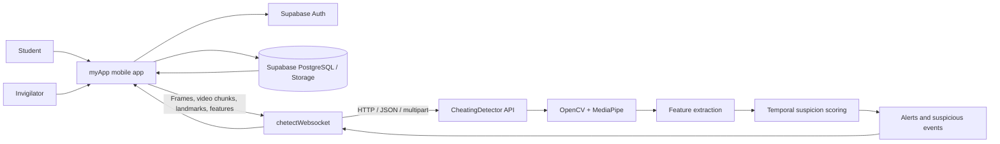

# Chetect: AI-Powered Exam Integrity Monitoring Platform

## Final Year Project Pitch Deck

---

## Slide 1: Title

### Chetect
AI-powered exam monitoring and cheating detection platform

- Mobile examination app for students and invigilators
- Real-time WebSocket gateway for live analysis
- Computer-vision AI model for suspicious behavior detection
- Secure data handling through Supabase

"Promoting academic integrity through intelligent, scalable, and privacy-conscious monitoring."

---

## Slide 2: The Problem

### Academic integrity is harder to maintain in modern remote and hybrid exams

Traditional proctoring methods are limited because they rely heavily on:

- Human invigilators watching many students at once
- Manual review of suspicious activity
- Reactive intervention rather than real-time detection
- Inconsistent monitoring quality across large classroom groups

### Why this matters

- Cheating undermines trust in academic results
- Institutions face pressure to scale assessments without reducing quality
- Remote and online exams increase exposure to misconduct
- There is a growing need for fair, consistent, and technology-assisted supervision

### Key challenge

We need a system that can:
- detect suspicious behavior in real time
- work under exam conditions without requiring a heavy, intrusive setup
- provide evidence that can support human review rather than replace judgment

---

## Slide 3: Solution Overview

### Chetect is a three-part system that works together

1. Mobile app (myApp)
   - Student and invigilator interface
   - Exam experience and live monitoring UI
   - Camera and media capture

2. WebSocket gateway (chetectWebsocket)
   - Real-time streaming layer
   - Connects mobile clients to the AI backend
   - Forwards frames, video chunks, landmarks, and features

3. AI model (CheatingDetector)
   - Computer-vision analysis engine
   - Detects gaze, head pose, face presence, blink behavior, and suspicious patterns
   - Produces risk scores, alerts, and suspicious event summaries

### Core idea

Use real-time data streams and AI-based analysis to flag suspicious activity early, while preserving a human review step for final decisions.

---

## Slide 4: Why This Project Matters

### Social and academic impact

- Promotes fairness in assessments
- Supports institutions with larger classes and limited invigilators
- Encourages students to maintain academic honesty
- Reduces reliance on inconsistent manual monitoring

### Practical impact

- Can be used for online tests, lab-based assessments, and supervised digital exams
- Helps institutions operate at scale
- Produces evidence logs and suspicious-event summaries that can be reviewed by staff

### Ethical importance

The system is designed to assist, not replace, human judgment.

- AI generates signals and risk indicators
- Human staff review the final evidence
- Privacy-conscious design and review workflow are central

---

## Slide 5: System Architecture

### Architectural summary

- The mobile app is the front-end layer
- The WebSocket gateway is the communication layer
- The AI model is the analysis engine
- Supabase connects the system to authentication and structured data storage

---

## Slide 6: Project 1 - The Mobile App (myApp)

### Role
The user-facing application for exam operations

### Main responsibilities

- Student authentication and role-based access
- Invigilator dashboard and monitoring views
- Exam session setup and session management
- Camera capture during assessments
- Live streaming of frames and video chunks
- Displaying confidence, alerts, and suspicious summaries
- Integration with backend session IDs and detector results

### Technology stack

- Expo / React Native
- TypeScript
- React Native screens and navigation
- Supabase for auth and data retrieval
- WebSocket-based real-time communication

### Key features

- Sign-in flow for students and staff
- Exam session orchestration
- Real-time proctoring lifecycle
- Responsive monitoring UI
- Review of suspicious events with evidence context

### Why it matters

Without a polished mobile client, the AI detection system would be unusable in practice. The app turns the system into a product users can actually interact with.

---

## Slide 7: Project 2 - The WebSocket Gateway (chetectWebsocket)

### Role
The real-time broker between the app and the model

### Main responsibilities

- Accept persistent WebSocket connections from the mobile app
- Receive image frames, video chunks, landmark payloads, and feature data
- Maintain detector session state
- Create or reset model sessions
- Forward requests to the detector API
- Return analysis results back to the client

### Why WebSockets

WebSockets are ideal for live classroom or exam monitoring because they allow:

- Low-latency communication
- Persistent connections across streaming sessions
- Efficient reuse of a single session during continuous monitoring

### Gateway behavior

- Ready handshake when connection is established
- Session creation and reuse
- Ping/pong health checks
- Configured state for frame mode, video mode, and analysis parameters
- Error handling for malformed payloads and invalid responses

### Technology stack

- Python
- FastAPI
- WebSocket endpoints
- HTTPX for backend calls
- CORS and origin validation

### Why it matters

The app needs low-latency, continuous analysis. The gateway ensures the AI engine can process incoming data reliably without overloading the client or the detector layer.

---

## Slide 8: Project 3 - The AI Model (CheatingDetector)

### Role
The intelligence layer that detects suspicious behaviors

### Main responsibilities

- Process frames and video submissions
- Detect and track facial landmarks
- Extract behavioral and visual features
- Score suspicion based on temporal patterns
- Group alerts into suspicious event intervals
- Return machine-readable and human-readable analysis output

### Core computer-vision stack

- Python
- FastAPI
- OpenCV
- MediaPipe
- NumPy
- Temporal scoring engine

### Detection signals include

- Head pose and orientation
- Gaze direction
- Eye openness / blink behavior
- Face presence or absence
- Low-light conditions
- Unusual movement patterns
- Multi-frame suspicious behavior trends

### Output types

- Observations: human-readable notes
- Signals: machine-readable indicators
- Alerts: compact incident summaries
- Events: grouped suspicious intervals across time
- Key frames: important frames ranked by risk score

### Why this matters

This project converts visual data into actionable evidence. It is the core reason the system can assist with exam integrity enforcement.

---

## Slide 9: How the System Works in Real Time

### End-to-end flow

1. Student starts an exam session in the mobile app.
2. The app opens a connection to the WebSocket gateway.
3. Camera frames or short video chunks are sent continuously.
4. The gateway forwards the payload to the CheatingDetector API.
5. The model analyzes the frame, extracts features, and scores behavior.
6. The gateway returns structured results back to the app.
7. The app displays alerts and suspicious summaries to the invigilator.
8. Staff review the results and decide whether further action is necessary.

### Benefits

- Real-time processing
- Continuous monitoring instead of one-off checks
- Lower manual burden on invigilators
- More consistency and objectivity in flagging suspicious behavior

---

## Slide 10: Core Features of the Platform

### For students

- Seamless exam experience
- Minimal friction during the assessment
- Clear session flow and login experience

### For invigilators

- Live monitoring interface
- Real-time anomaly notifications
- Review of suspicious events and evidence context
- Better oversight over large groups

### For administrators

- Session tracking and data capture
- Risk history and analysis summaries
- Integration with a data platform for future reporting and review

### For the system itself

- Scalable architecture
- Real-time communication pipeline
- AI decision support with human review
- Modular project separation for future evolution

---

## Slide 11: Data and Storage Model

### Supabase integration

Supabase provides:

- Authentication
- Database storage for session and analysis records
- Secure role-based access control
- Storage support for related exam metadata

### Important data concepts

- Analysis sessions
- Frame-level analysis records
- Suspicious events
- Review records and evidence summaries

### Why this matters

The system is not only about live detection; it also supports accountability and review. Data persistence allows institutions to audit decisions and track suspicious activity over time.

---

## Slide 12: Technical Challenges and How We Solved Them

### Challenge 1: Low latency

Real-time monitoring requires fast communication.

Solution:
- WebSocket gateway instead of repeated HTTP polling
- Lightweight streaming of frames and chunked video data
- Efficient model response handling

### Challenge 2: Unreliable or incomplete frame quality

Camera quality, lighting, and motion vary across contexts.

Solution:
- Model uses multi-signal analysis
- Temporal scoring reduces false positives from single-frame anomalies
- Different image/video handling paths improve robustness

### Challenge 3: False positives and false negatives

AI detection can never be perfectly deterministic.

Solution:
- Risk scores are used as evidence, not final proof
- Human review remains in the loop
- Model output is framed as support for monitoring and investigation

### Challenge 4: System integration across three projects

Different layers required consistent APIs and message formats.

Solution:
- Well-defined session IDs and message standards
- Shared conventions between app, gateway, and detector
- Modular project separation simplifies testing and extension

---

## Slide 13: Project Value Proposition

### For educational institutions

- Better academic integrity oversight
- Improved fairness at scale
- Reduced burden on manual invigilation
- More responsive interventions

### For students

- More transparent and fair assessment procedures
- Clearer standards for integrity and monitoring
- Focus on academic honesty rather than hidden surveillance

### For developers and future work

- Strong foundation for research extension
- Modular architecture supports future improvements
- Can be adapted for additional behavioral markers and institutional policies

---

## Slide 14: Why This Is a Strong Final Year Project

### It combines multiple disciplines

- Mobile application development
- Real-time networking
- Backend integration
- AI and computer vision
- Data modeling and storage
- Ethics and system design

### It solves a real-world problem

This is not just a demo; it addresses a meaningful challenge in modern education.

### It is practical and scalable

The design is modular and extensible, making it suitable for future enhancements.

### It demonstrates engineering maturity

The project shows we can connect:
- front-end UX
- backend services
- real-time transport
- AI-based analysis
- deployment-ready architecture

---

## Slide 15: Future Work and Expansion

### Short-term enhancements

- Better model calibration for different exam environments
- More refined suspicious-event grouping
- Additional confidence thresholds and alert tuning
- Improved visibility for invigilators

### Medium-term enhancements

- Integration of more behavioral signals
- Better session history and reporting dashboards
- Improved privacy-preserving monitoring pipelines
- Machine learning model refinement using labeled data

### Long-term vision

- Institutional deployment across departments and exam centers
- Support for larger remote assessment environments
- Decision-assistance platform for academic integrity teams
- Research-grade analytics for educational institutions

---

## Slide 16: Risk Management and Ethics

### Important principle

AI does not determine guilt; it supports review.

### Ethical safeguards

- Human review remains essential
- Output is treated as evidence, not proof
- Risk thresholds are configurable
- Privacy-aware design principles are respected
- False positive and false negative risks are acknowledged

### Governance conversation

This project is positioned as a decision-support system in the academic environment.

---

## Slide 17: Demo / User Journey

### Example scenario

A student begins an online assessment. The app records live frames. The gateway streams them to the detector. The AI inspects the student’s face and behavior. If unusual patterns appear, the system raises an alert. The invigilator reviews the evidence and can decide whether to follow up.

### This demonstrates:

- real-time operation
- integration across all layers
- practical usefulness of the system
- relevance to academic honesty workflows

---

## Slide 18: Summary

### Chetect is a full-stack academic integrity solution

- Mobile app for exam interactions
- WebSocket gateway for real-time analysis
- AI model for suspicious behavior detection
- Supabase for secure transaction and data records

### The project combines

- software engineering
- real-time systems
- computer vision
- human-centered design
- ethical AI in education

### Final message

Chetect is more than a detection tool; it is a smart academic integrity platform that supports fairness, oversight, and evidence-based review in modern assessment environments.

---

## Slide 19: Closing Statement

### "Using AI to support fairness in education, not to replace human judgment."

Chetect aims to create a practical, scalable, and ethical solution to one of the biggest challenges in digital education: ensuring assessments remain honest, fair, and trustworthy.

---

## Slide 20: Q&A / Team Acknowledgement

### Questions?

Thank you.

Potential closing notes:
- This project blends front-end design, backend engineering, real-time systems, and AI research.
- It has strong academic value and practical relevance.
- It can be extended into a broader academic integrity platform.

---

## Optional Appendix: Technical Stack Summary

### myApp
- Expo
- React Native
- TypeScript
- Supabase integration
- WebSocket client features

### chetectWebsocket
- Python
- FastAPI
- WebSockets
- HTTPX
- CORS and session management

### CheatingDetector
- Python
- FastAPI
- OpenCV
- MediaPipe
- NumPy
- Temporal risk scoring

### Shared infrastructure
- Supabase Auth and Postgres
- Session-based data flow
- Alert and event summarization

---

## Optional Appendix: One-Sentence Project Definition

Chetect is an end-to-end AI-assisted exam monitoring system that combines a mobile assessment app, a real-time WebSocket gateway, and a computer-vision detector to identify suspicious student behavior and support informed human review in academic assessments.
